# Repository, CI, Coding Standards, and ADR Template — Phase 0

- **Status:** Draft v0.1
- **Date:** 2026-08-28
- **Owner:** Platform Architect / SRE
- **References:** `../enterprise_waf_development_master_plan.md` (§10, §14.3, §7.3, §19), `../phase0_srs.md` (NFR-0.1-030..034)

---

## 1. Repository structure

Monorepo per master plan §10:

```text
shield-waf/
  apps/
    console-web/        # Next.js + TypeScript management console
    control-api/        # Go control-plane API
  gateways/
    openresty-gateway/  # Release 0.1 data plane
    rust-gateway/       # Phase 9 (empty placeholder)
  services/
    policy-compiler/    # Go, config generation (ADR-003)
    event-ingestor/     # Go, collector sidecar (ADR-006)
    learning-engine/    # Phase 6 (placeholder)
    update-service/     # Phase 8 (placeholder)
    notification-service/# Phase 4+ (placeholder)
  packages/
    policy-schema/      # JSON Schema v0 (source of truth, ADR-002)
    event-schema/       # JSON Schema v0 (source of truth)
    localization/       # ICU message catalogs (en, bn)
    sdk-go/             # shared Go types (generated from schema)
    sdk-typescript/     # shared TS types (generated)
  rules/                # Phase 2+
    core/ cve/ technology/ tests/
  deployments/
    compose/            # dev environment
    ansible/ helm/ appliance/   # later phases
  tests/
    conformance/ evasions/ performance/ failover/
  docs/
    architecture/       # ADRs + diagrams (this repo's docs)
    operations/ security/ api/
  .github/workflows/
  Makefile
  AGENTS.md
```

**Rules:**
- **Schema is source of truth:** `packages/policy-schema` and `packages/event-schema` JSON Schema files are the single definition; Go and TS SDK types are **generated** in CI — never hand-written and drifted.
- Protected default branch (e.g., `main`); all changes via PR with review (master plan §7.3: protected branches, mandatory review).
- Atomic schema + policy changes: a schema change and its consumers land in the same PR (monorepo rationale, ADR-001 D1).
- Placeholders are empty directories with a `README.md` explaining the planned phase — no dead code.

---

## 2. CI pipeline stages

```mermaid
flowchart LR
    A[PR opened] --> B[lint + format]
    B --> C[unit tests]
    C --> D[schema: generate SDK + golden tests]
    D --> E[i18n completeness + broken-key tests]
    E --> F[build images + SBOM]
    F --> G[integration tests on compose env]
    G --> H[restart/invalid-config/rollback tests]
    H --> I[performance regression gate*]
    I --> J[SAST + secret scan + dependency scan]
    J --> K[sign artifacts + publish]
```



- **`*` Performance regression gate:** runs the reference-bench subset (small-body, TLS, HTTP/1.1 keep-alive) on the bench; blocks on >5% p99 degradation at rated load (see `reference-hardware-performance-method.md`). On CI-only hardware it runs a smoke subset; the full bench is a scheduled nightly job.
- Every build produces a **SBOM** (CycloneDX), provenance attestation, and **signed artifacts** (release gate, §14.3).
- Fuzzing (HTTP, URL, JSON, XML, multipart, rule parser — Phase 2+) runs in scheduled jobs, not on every PR.
- Coverage thresholds: core parser/compiler modules enforced (configurable floor, reviewed at Phase 0 close).

---

## 3. Coding standards

### 3.1 General
- No default passwords, no secrets in code; secrets only via environment/KMS refs (SRS NFR-0.1-015).
- Comments explain *why*, not *what*; non-obvious security decisions must reference the ADR/threat-model ID.
- Every public API endpoint: authz test, negative-path test, audit event (Definition of Done, §19).
- Localization: no user-facing string hard-coded in components — always a message key (FR-0.1-061).

### 3.2 Go (control plane, services)
- Go standard toolchain, current supported version.
- Format with `gofmt`; lint with `golangci-lint`; enforce `go vet` clean.
- Errors handled explicitly; wrap with context (`fmt.Errorf("...: %w")`).
- No `panic` in request handlers; middleware recovers and converts to 500 + audit.
- Context propagation for cancellation/timeouts; server timeouts set explicitly.
- DB access via migration files (versioned); no raw ad-hoc schema changes.

### 3.3 TypeScript (console)
- TypeScript strict mode; no `any` without a documented justification.
- React/Next.js app router; client components minimal, data fetching server-side.
- All UI text via the i18n library (ICU keys); no inline strings.
- ESLint + Prettier enforced in CI.

### 3.4 Rust (Phase 9 gateway; standards set now)
- Edition per toolchain; `cargo fmt` + `clippy` with warnings denied in CI.
- No `unsafe` without a safety comment + review; document invariant per module.
- All user-input parsers must have fuzz targets and property tests from day one (rule 8).

### 3.5 SQL / schema
- Migrations are immutable once merged (no editing applied migrations — new migration instead).
- All timestamps `timestamptz`; public identifiers ULID text columns; numeric keys internal only.

---

## 4. ADR template

Every architecture decision uses this template. Filename: `adr-NNN-short-title.md` (monotonic NNN). Status lifecycle: `Proposed → Accepted → Superseded by ADR-NNN`.

```markdown
# ADR-NNN — <short imperative title>

- **Status:** Proposed | Accepted | Superseded by ADR-XXX
- **Date:** YYYY-MM-DD
- **Owner:** <role>
- **References:** <master plan §, SRS FR/NFR IDs, related ADRs>

## Context
<why this decision is needed; constraints; invariants it must satisfy>

## Decision
<what we decided; numbered sub-decisions D1..Dn; concrete, reviewable>

## Alternatives considered
<each rejected option: one short block with the rejection reason>

## Consequences
### Positive
### Negative
### Risks and mitigations  <table>

## Acceptance for this ADR
<checkable criteria that prove the decision was implemented>

## Follow-up ADRs expected
<links to known future ADRs>
```

**Gate:** an ADR is `Accepted` only after architecture review; changes that move a trust boundary, data flow, store, or protocol MUST have an ADR (Definition of Done).

---

## 5. PR / review conventions

- PR title matches the change scope; body references ADR/SRS/FR IDs.
- Reviewer checklist (enforced by a PR template):
  - [ ] Threat analysis covered (SRS §9 or new ADR)
  - [ ] Negative/error-path tests included
  - [ ] Permissions + tenant-isolation tests included
  - [ ] Audit coverage for mutations
  - [ ] Metrics + structured logs added/changed
  - [ ] English + Bangla labels present
  - [ ] API + operator docs updated
  - [ ] Upgrade/rollback considered
  - [ ] Diagrams updated if a boundary/data-flow changed
- No direct pushes to `main`; branch protection + required reviews; signed commits per organization policy (§7.3).
- **Commit tasks:** Every finished task must be committed to git with a clear, descriptive commit message relating to the task. This ensures any AI or human can understand the repository history and context.

---

## 6. Definition of done reminder

A feature is complete only when it meets all §19 criteria of the master plan. This document makes the operational mechanics of those criteria concrete; the checklist above is the enforcement point.
