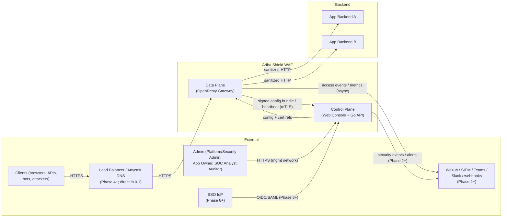
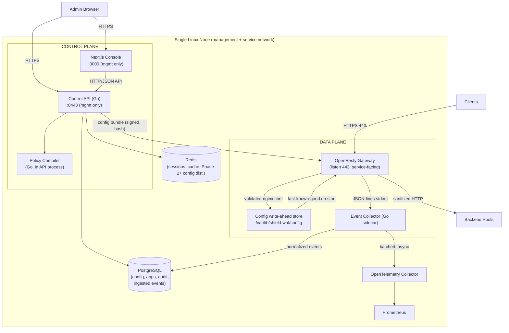
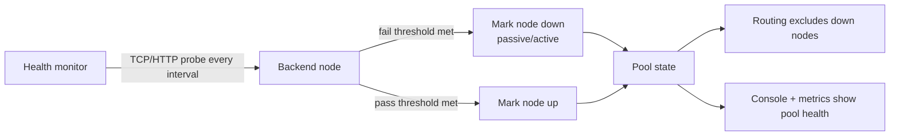
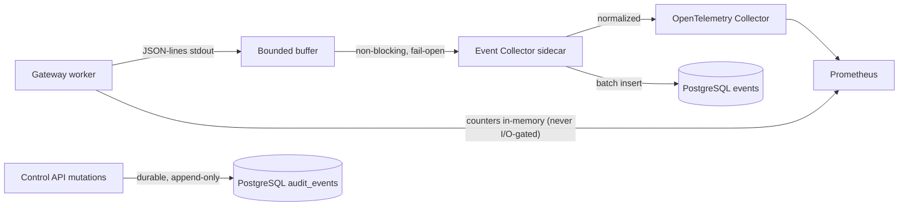

# System Context and Data-Flow Diagrams — Phase 0

- **Status:** Draft v0.1
- **Date:** 2026-08-28
- **Owner:** Platform Architect
- **References:** `enterprise_waf_development_master_plan.md` (§3, §5, §7), `phase0_srs.md` (§8 Deployment topology, §9 Threat model), `docs/architecture/adr-001-initial-architecture.md`, `adr-002-policy-event-schema-v0.md`, `adr-003-config-generation-atomic-reload.md`, `adr-006-logging-event-pipeline.md`

---

## 1. Level 1 — System context (C4)



**Boundary note:** The control plane is **outside the client→gateway→backend path** (master plan §3.2). A control-plane outage never affects live traffic (last-known-good cache, ADR-003).

---

## 2. Level 2 — Containers (Release 0.1 single node)



---

## 3. Data-flow diagrams

### 3.1 DFD-1 — Configuration flow (control → data plane)

```mermaid
flowchart LR
    A[Admin edits app/pool/virtual server] --> B[Control API\nvalidate + version]
    B --> C[Compiler: policy doc -> nginx conf\ncanonical serialization]
    C --> D[Sign bundle + compute hash\n(ADR-002)]
    D --> E[Stage version in write-ahead store\n(ADR-003 D2)]
    E --> F{nginx -t\nvalidation}
    F -- fail --> G[Rejected; active untouched; audit event]
    F -- pass --> H[Atomic rename active pointer + SIGHUP reload]
    H --> I{healthy soak\n60 s}
    I -- ok --> J[Promote last-known-good; report applied hash]
    I -- fail --> K[Rollback to last-known-good; reload; audit event]
```

**Trust boundary:** step D→E crosses from control plane to data plane. The bundle is signed (ed25519) and hash-verified by the gateway (mTLS in Phase 4; hash verify from 0.1).

### 3.2 DFD-2 — Request flow (data plane)

```mermaid
flowchart LR
    R[Client request] --> A[TCP accept + conn limits]
    A --> B[TLS handshake\n(system OpenSSL)]
    B --> C[Strict HTTP parse\nreject ambiguous framing]
    C --> D[Resolve virtual server by SNI/Host]
    D --> E[Apply size limits + trusted proxy headers]
    E --> F[Select healthy backend\n(health state from DFD-3)]
    F --> G[Forward sanitized request]
    G --> H[Backend response + upstream status]
    H --> I[Emit access event (stdout, non-blocking)\n+ metrics (in-memory)]
```

> Release 0.1 has **no security parsing** in this path. When Phase 2 adds the Coraza engine, the normalized representation produced at step C is the **single** representation inspected (master plan rule 1; ADR-003 D5) — the pipeline inserts an inspection step here without a second parse.

### 3.3 DFD-3 — Health check flow



### 3.4 DFD-4 — Event flow (data → control/observability)



**Loss policy (ADR-006):** access events are best-effort with a drop counter; audit events are durable and lossless. Two separate streams.

---

## 4. Trust boundaries

| # | Boundary | Sides | Notes |
|---|---|---|---|
| TB1 | Internet ↔ Gateway | Untrusted clients vs service-facing edge | TLS termination; strict HTTP parse; size limits |
| TB2 | Gateway ↔ Backends | Trusted network, sanitized requests | Trusted proxy headers set by gateway; upstream host pinned |
| TB3 | Gateway ↔ Control Plane | mTLS (Phase 4), signed bundles | Control plane never proxies traffic |
| TB4 | Admin ↔ Control Plane | Authenticated users, management network | HTTPS only; roles/least privilege; MFA on local admin |
| TB5 | Control Plane ↔ PostgreSQL/Redis | Trusted internal | DB creds via secrets; envelope encryption at rest |
| TB6 | Gateway ↔ Collector/OTel | Trusted sidecar on same node | Non-blocking stdout transport |

Full STRIDE threat list and mitigations: `phase0_srs.md` §9.

---

## 5. Data classification

| Data | Class | Storage (0.1) | Notes |
|---|---|---|---|
| Client request bodies/cookies/credentials | **Sensitive** | Never stored/logged in 0.1 | Rule 5; ADR-002 D3 |
| Config blobs + TLS cert refs | Confidential | Write-ahead store + PostgreSQL (blob) | Encrypted at rest (envelope), signed |
| Audit events | Confidential | PostgreSQL, append-only | Immutable, lossless |
| Access/health events | Internal | PostgreSQL, retention 30 d | Best-effort, masked, no payloads |
| Metrics | Internal | Prometheus (retention) | Aggregates only |

---

## 6. Diagram maintenance rules

- Every architectural change that moves a data flow, boundary, or store must update these diagrams **in the same PR** (Definition of Done: "Approved design/ADR when architecture changes").
- Diagrams live as Mermaid source in `docs/architecture/`; rendered in CI to catch syntax errors.
- Versioned together with the schema ADRs (ADR-002) so diagrams and contracts never drift.
