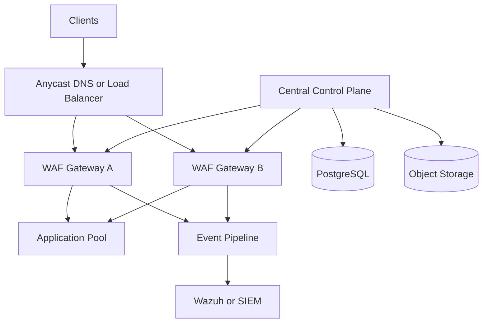

# Enterprise Centralized WAF — Development Master Plan

**Working name:** Ariba Shield WAF  
**Target:** Centralized, Linux-hosted, web-managed enterprise Web Application Firewall  
**Long-term ambition:** F5 Advanced WAF-class capabilities, performance, reliability, operations, and security assurance  
**Document status:** Master roadmap v1.0  
**Planning horizon:** Approximately 30–48 months for a mature enterprise product; usable releases delivered incrementally

---

## 1. Executive decision

Build the platform in two planes:

1. **Data Plane** — handles live client traffic, TLS, HTTP parsing, normalization, inspection, enforcement, proxying, load balancing, and health checks.
2. **Control Plane** — centralized web software for applications, policies, certificates, rules, users, analytics, updates, licensing, cluster management, and audit.

The first production-capable editions should use a proven proxy and proven rule engine underneath a custom control plane. A fully custom high-performance Rust data plane should begin only after the product has stable semantics, a complete test corpus, performance baselines, and operational experience.

The product must never claim “F5 equivalent” based only on feature count. Enterprise grade requires measurable security efficacy, low false positives, predictable latency, fail-safe behavior, high availability, safe upgrades, supportability, and independent testing.

---

## 2. Product goals

### 2.1 Primary goals

- Protect multiple web applications and APIs from one central platform.
- Run on Linux as software, VM appliance, container, or Kubernetes deployment.
- Support reverse-proxy and transparent operational models over time.
- Inspect HTTP/1.1, HTTP/2, WebSocket, REST, GraphQL, JSON, XML, multipart forms, and file uploads.
- Provide negative security, positive security, behavioral learning, bot defense, rate limiting, and API protection.
- Offer English and Bangla UI initially, with an extensible internationalization system.
- Integrate with Wazuh, syslog, SIEM, SOAR, email, Microsoft Teams, Slack, and webhooks.
- Support centralized management of distributed WAF gateways.
- Maintain traffic availability even when the central control plane is temporarily unavailable.

### 2.2 Non-goals for early releases

- Do not build a custom TLS implementation.
- Do not invent cryptography.
- Do not advertise zero-day prevention without independently validated evidence.
- Do not use generative AI as the blocking authority.
- Do not send full sensitive request bodies to a cloud AI service.
- Do not attempt L3/L4 volumetric DDoS mitigation in the first releases.

---

## 3. Reference architecture



### 3.1 Data-plane rule

Gateways keep a signed, versioned, locally cached last-known-good configuration. If the control plane fails, protected applications must continue serving traffic using that configuration.

### 3.2 Control-plane rule

The control plane never sits directly in the traffic path. It distributes policies and receives telemetry asynchronously.

### 3.3 Deployment modes

1. **Single-node lab:** control plane and gateway on one Linux server.
2. **Enterprise HA:** two or more gateways, separate control-plane cluster, PostgreSQL HA, Redis, object storage.
3. **Distributed branches/DCs:** central control plane with gateways in multiple locations.
4. **Kubernetes:** ingress/gateway deployment with central policy management.
5. **Offline/air-gapped:** signed offline rule and software update packages.

---

## 4. Recommended technology strategy

| Area | Early implementation | Mature implementation |
|---|---|---|
| Traffic proxy | OpenResty/Nginx or Envoy | Custom Rust gateway where justified |
| Rule engine | Coraza/ModSecurity-compatible engine + OWASP CRS | Optimized compiled internal engine plus compatibility layer |
| Control API | Go | Go microservices/modules |
| High-performance components | Go initially | Rust for parser, normalization, matching, and proxy hot paths |
| Admin UI | Next.js + TypeScript | Same, modular enterprise console |
| Primary database | PostgreSQL | PostgreSQL HA and partitioning |
| Cache/config distribution | Redis Streams initially | NATS JetStream or Kafka according to measured scale |
| Event analytics | PostgreSQL for MVP | ClickHouse for high-volume events |
| Object storage | MinIO/S3-compatible | Distributed object storage |
| Telemetry | OpenTelemetry + Prometheus | Same with scalable collectors |
| Packaging | Docker Compose | OCI images, VM appliance, Kubernetes/Helm |
| Automation | Ansible | Ansible + Kubernetes Operator |

### 4.1 Language boundaries

- **Rust:** latency-sensitive and memory-safe traffic components.
- **Go:** control plane, agents, orchestration, policy compiler, update service.
- **TypeScript:** web console only.
- **Python:** offline analytics, training, QA tooling, rule research; never the core synchronous traffic path.
- **Lua:** temporary OpenResty extensions only; avoid making Lua the long-term business-logic layer.

Each service must have an explicit reason to exist. Start as a modular monolith for the control plane; split services only when scaling, isolation, or team ownership justifies it.

---

## 5. Request-processing pipeline

Every request follows a deterministic pipeline:

1. Accept TCP/QUIC connection when supported.
2. Apply connection limits and reputation pre-checks.
3. Negotiate TLS using maintained system libraries.
4. Parse HTTP strictly and reject ambiguous/smuggling-prone messages.
5. Normalize host, path, query, headers, cookies, and body representations.
6. Resolve tenant, application, listener, route, and policy.
7. Apply IP list, geo, ASN, and threat-intelligence checks.
8. Apply bot/client classification and challenge state.
9. Enforce protocol, method, size, content-type, and schema policies.
10. Extract arguments from query, form, JSON, XML, GraphQL, and multipart bodies.
11. Execute attack signatures in phases.
12. Calculate category scores and total anomaly score.
13. Evaluate positive security and application-specific rules.
14. Apply rate limits and abuse controls.
15. Decide allow, log, mask, challenge, redirect, rate-limit, or block.
16. Select a healthy backend pool member.
17. Forward a sanitized request with trusted proxy headers.
18. Inspect response metadata and selected response bodies.
19. Apply data-leakage and response-security rules.
20. Emit structured event, metric, trace, and audit references asynchronously.

### 5.1 Required anti-evasion normalization

- Single and controlled repeated URL decoding
- Unicode normalization and invalid encoding handling
- HTML entity decoding where relevant
- Null byte detection
- Path canonicalization
- Slash and backslash normalization rules
- Case normalization only where protocol semantics allow
- Content-encoding decompression with bomb limits
- Chunked-body validation
- Duplicate header and parameter policy
- Conflicting Content-Length/Transfer-Encoding rejection
- JSON depth, token, and duplicate-key limits
- XML entity, DTD, depth, and expansion controls
- Multipart boundary and filename normalization

Raw and normalized representations must be retained as separate bounded views for correct detection and evidence.

---

## 6. Core product modules

### 6.1 Application delivery

- Virtual servers/listeners
- Domains and SNI routing
- TLS termination and optional re-encryption
- Backend pools and nodes
- Active/passive health monitors
- Load-balancing algorithms
- Session persistence
- Header rewrite policies
- Redirects and maintenance pages
- WebSocket proxying
- Connection draining
- Circuit breaking and retries with safe defaults

### 6.2 WAF policy engine

- Policy templates: Basic, Balanced, Strict, API, Banking/High Risk
- Transparent, alarm, blocking, and staged enforcement
- Signature categories and severity
- Anomaly scoring
- Executing versus blocking sensitivity levels
- URL, parameter, cookie, header, file-type, and method policies
- Request and response size constraints
- Per-route and per-parameter exclusions
- Time-limited exceptions with owner and justification
- Policy inheritance: global → tenant → application → route
- Policy diff, review, approval, rollback, and version history

### 6.3 Signature lifecycle

- Human-readable rule source format
- Stable rule IDs
- Tags: attack class, technology, CVE, confidence, sensitivity
- Compiler to immutable gateway bundles
- Digital signing and verification
- Staging period
- Canary distribution
- Rollback
- False-positive feedback
- Expiration/deprecation
- Automated regression tests for every rule
- Emergency signature release workflow

### 6.4 Positive security and API protection

- OpenAPI import and discovery comparison
- Allowed paths and methods
- Parameter type, length, range, regex, and enum
- JSON Schema validation
- XML schema/profile validation where required
- GraphQL operation, depth, complexity, and introspection policies
- JWT structural validation and issuer/audience/key policies
- API key/rate policy without storing plaintext secrets
- Unknown endpoint discovery
- Shadow and zombie API identification
- Sensitive-data classification and response leakage detection

### 6.5 Learning and policy builder

- Learn URLs, methods, parameters, content types, cookies, schemas, and typical sizes.
- Separate trusted learning sources from untrusted traffic.
- Never auto-allow solely because an entity was observed.
- Require traffic volume, source diversity, time, and confidence thresholds.
- Produce suggestions with evidence, risk, and impact.
- Support manual and guarded automatic acceptance.
- Detect policy drift.
- Allow executing stricter rules in observation while enforcing a lower level.
- Maintain poisoning resistance and rollback.

### 6.6 Bot and abuse defense

- Known bot verification
- User-agent and automation indicators
- JavaScript/browser challenge
- Proof-of-work option for selected endpoints
- CAPTCHA provider abstraction
- Device/client token with rotation and privacy controls
- Login brute-force protection
- Credential-stuffing signals
- Scraping detection
- Account enumeration protection
- OTP abuse protection
- Per-IP, user, device, session, route, API key, ASN, and tenant limits
- Progressive actions: observe → slow → challenge → temporary block

Do not base a permanent block on fingerprinting alone.

### 6.7 Threat intelligence

- Manual IP/CIDR lists
- Expiring allow/block entries
- Feed ingestion with signatures and provenance
- Confidence, category, source, first/last seen, and TTL
- Domain/URL/IP/ASN indicators
- Feed conflict resolution
- Never block globally from a low-confidence feed without policy approval

### 6.8 Event and incident system

- Unique support/event ID visible to users on block pages
- Request metadata, matched rules, normalized excerpts, decision path
- Payload masking and configurable retention
- Correlation by application, IP, identity, device, session, attack type
- Incident grouping and severity
- Analyst status, notes, owner, verdict, escalation
- PCAP linkage only when explicitly enabled and legally permitted
- Wazuh/syslog/CEF/LEEF/JSON/webhook output
- Exportable technical and executive reports

### 6.9 Central management

- Organizations/tenants
- Sites/data centers
- Gateway clusters
- Applications and policies
- Certificates and secrets references
- Users, groups, SSO, MFA, RBAC
- Approval workflows
- Rule/signature updates
- Backup and restore
- License/entitlement if commercialized
- System health, capacity, versions, and drift

### 6.10 Internationalization

- English as canonical message/source language.
- Bangla as the first translated language.
- ICU-compatible message keys; no UI text hard-coded in components.
- Locale-aware dates, time zones, numbers, and pluralization.
- User-selected language stored in profile.
- Security event fields remain stable machine-readable codes; labels are translated at display time.
- Translation completeness and broken-key tests in CI.

---

## 7. Security model for the WAF itself

### 7.1 Identity and access

- OIDC/SAML SSO
- MFA for local emergency accounts
- RBAC roles: Super Admin, Platform Admin, Security Admin, App Owner, SOC Analyst, Auditor, Read Only
- Tenant and application scoping
- Four-eyes approval for blocking policy, certificate, update, and emergency changes
- Short-lived sessions and step-up authentication for sensitive actions
- Break-glass accounts with strong monitoring

### 7.2 Secrets and certificates

- Encrypt secrets at rest using envelope encryption.
- Support external Vault/KMS/HSM integrations.
- Never return private keys from APIs after import.
- Use mTLS between control plane and gateways.
- Rotate gateway identity automatically.
- Sign every config and rule bundle.
- Maintain certificate expiry monitoring and controlled renewal.

### 7.3 Software supply chain

- Protected branches and mandatory review
- Signed commits/releases according to organization policy
- Reproducible or provenance-attested builds
- SBOM for every release
- Dependency and container scanning
- Secret scanning
- SAST, DAST, fuzzing, and license scanning
- Signed OCI images and packages
- Staged updates and rapid rollback
- Published security response and CVE handling process

### 7.4 Secure defaults

- Management API not exposed publicly by default.
- UI/API bind to management network.
- No default passwords.
- Sensitive payload collection disabled by default.
- Fail closed only when safe for the configured risk class; otherwise explicit fail-open/fail-closed policy.
- All configuration changes are immutable audited events.

---

## 8. Data model domains

Use UUID/ULID-style public identifiers and internal numeric keys only where necessary. Core domains:

- `organizations`, `tenants`, `sites`
- `gateway_clusters`, `gateways`, `gateway_heartbeats`
- `applications`, `listeners`, `routes`, `backend_pools`, `backend_nodes`, `health_monitors`
- `tls_profiles`, `certificate_metadata`, `secret_references`
- `security_policies`, `policy_versions`, `policy_bindings`, `policy_approvals`
- `rules`, `rule_versions`, `rule_tags`, `rule_tests`, `rule_bundles`
- `exceptions`, `ip_lists`, `threat_feeds`
- `rate_limit_policies`, `bot_policies`, `api_schemas`
- `security_events`, `event_matches`, `incidents`
- `users`, `groups`, `roles`, `permissions`, `sessions`
- `audit_events`, `deployment_jobs`, `update_channels`
- `notification_channels`, `integrations`

High-volume security events should eventually move to ClickHouse. PostgreSQL retains authoritative configuration, workflow, and audit metadata.

---

## 9. Management UI information architecture

1. Overview
2. Applications
3. Traffic
4. Security Events
5. Incidents
6. Policies
7. Rules and Signatures
8. API Security
9. Bot and Abuse Defense
10. IP Intelligence
11. Certificates
12. Backend Pools
13. Gateways and Clusters
14. Integrations
15. Reports
16. Users and Access
17. Audit Log
18. System Settings

The UI must show the exact effective policy and inheritance source. Every block event must explain what matched, where, what normalized value was inspected, the action, and which policy version made the decision.

---

## 10. Repository and service structure

```text
shield-waf/
  apps/
    console-web/
    control-api/
  gateways/
    openresty-gateway/
    rust-gateway/
  services/
    policy-compiler/
    event-ingestor/
    learning-engine/
    update-service/
    notification-service/
  packages/
    policy-schema/
    event-schema/
    localization/
    sdk-go/
    sdk-typescript/
  rules/
    core/
    cve/
    technology/
    tests/
  deployments/
    compose/
    ansible/
    helm/
    appliance/
  tests/
    conformance/
    evasions/
    performance/
    failover/
  docs/
    architecture/
    operations/
    security/
    api/
```

Use a monorepo initially for atomic schema and policy changes. Establish versioned contracts between data plane and control plane from the first release.

---

## 11. API and configuration principles

- REST/JSON external management API with OpenAPI specification.
- gRPC or streaming transport for internal gateway control where beneficial.
- All writes accept idempotency keys.
- Optimistic concurrency/version checks for policy edits.
- Configuration is declarative and versioned.
- Every deployment produces an immutable bundle hash.
- Gateways report applied hash, status, and validation errors.
- No partial policy activation: validate, stage, and atomically switch.
- Backward compatibility matrix between control-plane and gateway versions.

Example deployment state:

```text
DRAFT → VALIDATING → APPROVAL_REQUIRED → APPROVED
      → CANARY → ACTIVE → SUPERSEDED
                         ↘ ROLLED_BACK
```

---

## 12. High availability and failure behavior

### 12.1 Gateway HA

- At least two gateways per production site.
- External load balancer, ECMP, VRRP/keepalived, or platform-native service.
- Stateless request processing where possible.
- Shared state only for rate limits, challenges, and selected persistence.
- Graceful degradation if shared state is unavailable.
- Connection draining during maintenance.

### 12.2 Control-plane HA

- Multiple API instances
- PostgreSQL primary/standby with tested failover
- Redis/NATS clustered according to need
- Object storage replication
- Scheduled encrypted backups
- Point-in-time database recovery
- Separate disaster-recovery environment

### 12.3 Explicit failure matrix

Define and test behavior for:

- Control plane unreachable
- Event pipeline unavailable
- Redis/NATS unavailable
- Database unavailable
- Rule bundle rejected
- TLS certificate expired
- Gateway resource exhaustion
- Backend partially or fully unhealthy
- Clock skew
- Update interrupted
- Split brain
- Disk full

Traffic decisions must never depend on writing a log successfully.

---

## 13. Performance and capacity targets

Targets must be hardware-specific and benchmarked; never publish unqualified throughput.

### Initial targets on a defined reference server

- Gateway availability: 99.95% single-site platform target after HA release
- Added p50 latency: ≤ 2 ms for small inspected requests
- Added p99 latency: ≤ 10 ms under rated load
- Config apply: ≤ 30 seconds across 100 gateways
- Zero dropped audit configuration events
- Event backpressure without blocking live traffic
- Sustained inspection throughput and requests/sec published for exact CPU, RAM, TLS version, cipher, payload, HTTP version, policy, and logging mode

Benchmark separately:

- Plain HTTP versus TLS
- HTTP/1.1 versus HTTP/2
- Keep-alive versus new connections
- Small/medium/large body
- Detection-only versus blocking
- CRS sensitivity levels
- JSON/XML/multipart
- Response inspection
- File upload scanning
- Normal versus attack-heavy traffic

Use flame graphs, allocation profiling, fuzz coverage, and deterministic replay.

---

## 14. Security efficacy and QA program

### 14.1 Test layers

- Unit tests
- Parser conformance tests
- Property-based tests
- Fuzz tests for HTTP, URL, JSON, XML, multipart, and rule parser
- Golden policy compilation tests
- Attack rule positive/negative corpus
- False-positive corpus from legitimate applications
- Differential tests against reference engines
- Integration tests
- Upgrade/rollback tests
- HA and chaos tests
- Load and soak tests
- Penetration tests of management and data planes

### 14.2 Required adversarial categories

- Request smuggling and desynchronization
- Parser differentials
- Encoding and double-encoding evasions
- SQLi, XSS, command injection, SSTI
- Path traversal, LFI/RFI, SSRF indicators
- XXE and XML bombs
- JSON parser abuse and depth bombs
- GraphQL depth/complexity abuse
- Multipart/file upload evasions
- Cache poisoning/deception patterns
- Host-header and routing attacks
- WebSocket policy bypass
- Authentication and business-abuse scenarios
- Bot/challenge bypass
- Resource exhaustion controls

### 14.3 Release gates

A release cannot ship unless:

- All critical parser/security tests pass.
- No open Critical/High management-plane vulnerability exists without formal risk acceptance.
- Upgrade and rollback pass.
- Config compatibility passes.
- Performance regression stays within budget.
- SBOM and signed artifacts are generated.
- Documentation and migration notes are complete.

---

## 15. Phased development roadmap

## Phase 0 — Foundation and threat model (Weeks 1–4)

**Deliverables**

- Product requirements and non-goals
- System context/data-flow diagrams
- STRIDE-style threat model
- Trust boundaries and data classification
- Reference hardware and performance method
- Repository, CI, coding standards, ADR template
- Versioned policy and event schema v0
- Initial backlog and definition of done

**Exit criteria:** architecture review approved; no coding of the live proxy before parsing, failure, and trust decisions are documented.

## Phase 1 — Lab reverse proxy (Weeks 5–10)

**Deliverables**

- One Linux-node installer
- HTTPS virtual server
- Backend pool and health check
- Request ID and structured access log
- Basic admin authentication
- Application CRUD
- English/Bangla shell UI
- Safe config validation and reload

**Exit criteria:** proxy survives restart, invalid config cannot break the active listener, and last-known-good config restores automatically.

## Phase 2 — WAF MVP / detection only (Weeks 11–20)

**Deliverables**

- Integrated mature rule engine and OWASP CRS baseline
- Request normalization controls
- SQLi/XSS/path/command/file inclusion categories
- Transparent mode
- Security event dashboard
- Masked event storage
- Per-application policy
- Rule exclusions and event support ID
- Wazuh/syslog integration

**Exit criteria:** replay corpus has stable results; legitimate test applications run with documented tuning; no blocking in production yet.

## Phase 3 — Safe blocking release (Months 6–8)

**Deliverables**

- Alarm/block flags and anomaly thresholds
- Signature staging
- Canary policy deployment
- Policy versioning, diff, approval, atomic activation, rollback
- IP/CIDR lists
- Rate limits
- Custom block pages
- RBAC and immutable audit log

**Exit criteria:** controlled applications can move from transparent to blocking with an approved false-positive baseline and tested rollback.

## Phase 4 — Application delivery and HA (Months 9–12)

**Deliverables**

- Multi-gateway central management
- Signed policy bundles and mTLS
- Gateway HA and config cache
- Load-balancing algorithms
- Session persistence
- TLS re-encryption
- Connection draining
- Backup/restore
- Prometheus/OpenTelemetry observability

**Exit criteria:** gateway/control-plane/network failure drills pass without unexpected traffic loss.

## Phase 5 — Positive security and API WAF (Months 13–17)

**Deliverables**

- URL/method/parameter profiles
- JSON/XML validation
- OpenAPI import and endpoint inventory
- JWT policies
- GraphQL protection
- Unknown API discovery
- Sensitive response leakage controls
- Schema drift alerts

**Exit criteria:** selected API applications enforce schemas with measured false-positive rate and documented exceptions.

## Phase 6 — Learning and policy builder (Months 18–22)

**Deliverables**

- Traffic entity discovery
- Trusted-source learning
- Statistical suggestions
- Manual/automatic modes
- Poisoning resistance
- Executing versus blocking sensitivity
- Suggestion evidence and confidence
- Policy drift dashboard

**Exit criteria:** learning cannot directly weaken policy without configured approval; poisoning tests pass.

## Phase 7 — Bot and account protection (Months 23–27)

**Deliverables**

- Bot classifications
- Browser/JavaScript challenge
- CAPTCHA abstraction
- Scraping and automation signals
- Login, OTP, credential-stuffing, enumeration controls
- Distributed rate limiting
- Privacy and accessibility review

**Exit criteria:** challenge accessibility, fallback, privacy, bypass, and performance tests pass.

## Phase 8 — Enterprise operations (Months 28–32)

**Deliverables**

- SSO/MFA and granular multi-tenant RBAC
- Four-eyes approvals
- Offline signed update packages
- Fleet update channels and rollback
- DR workflows
- Capacity planning
- Long-term event analytics in ClickHouse
- Reports and compliance exports
- Support bundle with privacy redaction

**Exit criteria:** full backup restore, site loss simulation, and rolling upgrade pass.

## Phase 9 — Custom high-performance gateway (Months 30–40, parallel after stability)

**Deliverables**

- Rust proxy/parser prototype
- Formal protocol test suite
- Differential behavior against existing gateway
- Compiled rule matching
- Zero-copy/bounded buffering where safe
- Multiprocess/core scaling
- HTTP/2 and WebSocket parity
- Gradual canary replacement

**Exit criteria:** equal or better security semantics, lower or justified latency, fuzzing maturity, operational parity, and instant rollback to the proven gateway.

## Phase 10 — External assurance and commercial readiness (Months 36–48)

**Deliverables**

- Independent penetration testing
- Security efficacy testing
- Secure development lifecycle evidence
- Published hardening and deployment guides
- Support/SLA system
- Vulnerability disclosure program
- Release/security advisory process
- Relevant certification readiness based on target markets
- Multi-year maintenance policy

**Exit criteria:** claims are evidence-backed, reference customers complete controlled production pilots, and support can reproduce/resolve incidents.

---

## 16. Suggested release editions

| Release | Purpose | Production position |
|---|---|---|
| 0.1 Lab | Proxy and UI | Lab only |
| 0.5 Sensor | Detection, events, Wazuh | Production observation with caution |
| 1.0 Protect | Safe blocking, policies, rollback | Selected internal applications |
| 1.5 HA | Gateway cluster and central fleet | General internal production |
| 2.0 API | Positive security and API WAF | API workloads |
| 2.5 Learn | Policy builder | Assisted tuning |
| 3.0 Bot | Bot/account defense | High-abuse public apps |
| 4.0 Enterprise | Multi-tenant, DR, updates, analytics | Enterprise deployment |
| 5.0 Data Plane | Custom optimized gateway | Only after parity validation |

---

## 17. Team plan

An F5-class product cannot safely be maintained by one developer long term.

### Minimum serious team after MVP

- Product/security architect: 1
- Data-plane/proxy engineers: 2–4
- Backend/control-plane engineers: 2–3
- Frontend engineer: 1–2
- Detection/signature security researchers: 2–3
- QA/security automation engineers: 2
- SRE/platform engineer: 1–2
- Technical writer/support engineer: 1
- Product/UX: shared or 1

One person can build the early lab MVP, but production blocking, parser security, HA, and reliable updates require independent review and specialist ownership.

---

## 18. Initial 12-week execution backlog

### Sprint 1 — Weeks 1–2

- [x] Finalize name and scope. (Ariba Shield WAF)
- [x] Create repository and CI. (Makefile, package.json configured)
- [x] Write threat model and ADR-001 architecture. (docs/architecture/adr-001 + SRS §9)
- [x] Define application, gateway, policy, event schemas. (Completed in Enterprise API Specification & openapi-v0.yaml)
- [x] Define Linux reference environment.

### Sprint 2 — Weeks 3–4

- [x] Docker Compose development environment. (deployments/compose/)
- [x] PostgreSQL migrations. (apps/control-api/migrations 0001–0004)
- [x] Go control API skeleton. (Handlers for domains, origins, policies, metrics, rate_limits, ip_lists added)
- [x] Next.js login/layout/i18n. (Premium Glassmorphism Dashboard UI completed)
- [x] Gateway registration protocol design. (ADR-004)

### Sprint 3 — Weeks 5–6

- [x] OpenResty/Nginx gateway image.
- [x] Virtual server, TLS, backend pool.
- [x] Health checks.
- [x] Config generator and strict validation.
- [x] Atomic last-known-good reload.

### Sprint 4 — Weeks 7–8

- [x] Application and backend management UI.
- [x] Gateway heartbeat/status.
- [x] Request ID and JSON logs.
- [x] Prometheus baseline metrics.
- [x] Restart and invalid-config tests.

### Sprint 5 — Weeks 9–10

- [x] Integrate Coraza/ModSecurity-compatible WAF path.
- [x] OWASP CRS detection-only policy. (baseline rules; full CRS is Phase 2+)
- [x] Security event schema and ingestion.
- [x] Sensitive-field masking.
- [x] Basic event list/detail UI.

### Sprint 6 — Weeks 11–12

- [x] Per-application policy binding.
- [x] Transparent event filtering.
- [x] Wazuh/syslog JSON output. (wazuh-forward adapter; live Wazuh not yet wired)
- [x] Replay test harness.
- [x] First legitimate and malicious traffic corpus.
- [x] Lab release 0.1 documentation and demo. (docs/operations/release-0.1.md)

---

## 19. Definition of done for every feature

A feature is complete only when it has:

- Approved design/ADR when architecture changes
- Threat analysis
- Unit and integration tests
- Negative/error-path tests
- Permissions and tenant-isolation tests
- Metrics and structured logs
- Audit coverage for mutations
- English and Bangla labels
- API documentation
- Operator documentation
- Upgrade and rollback consideration
- Performance impact measured where it touches traffic
- Security review

---

## 20. Metrics that determine product maturity

### Protection

- True-positive rate by attack category
- False-positive rate by application/policy
- Evasion test pass rate
- Mean time to publish emergency signature
- Policy tuning time

### Performance

- Requests/sec and throughput on reference hardware
- Added p50/p95/p99 latency
- TLS handshakes/sec
- CPU and memory/request
- Event loss/backlog

### Reliability

- Gateway and control-plane availability
- Config deployment success rate
- Rollback time
- Recovery time and recovery point achieved
- Upgrade failure rate

### Operations

- Mean time to understand a block
- Mean time to resolve false positive
- Fleet drift count
- Certificate expiry incidents
- Analyst event-to-incident conversion

---

## 21. Standards and reference baselines

- OWASP Core Rule Set for initial signature/anomaly concepts and regression baseline.
- OWASP ASVS and OWASP API Security Top 10 for protected-application security coverage.
- OWASP WAF Evaluation Criteria as one input to product evaluation, noting its maturity/version limitations.
- RFC-compliant HTTP semantics and strict anti-smuggling interpretation.
- OpenAPI and JSON Schema for API validation.
- OpenTelemetry for logs, metrics, and traces.
- Prometheus/OpenMetrics for operational metrics.
- SPDX or CycloneDX for SBOM.
- SLSA-aligned build provenance goals.
- NIST Secure Software Development Framework for development governance.

OWASP CRS sensitivity/paranoia levels and anomaly thresholds are separate controls. Higher sensitivity increases coverage and false-positive tuning requirements; do not activate the strictest level in blocking mode without observation and tuning.

---

## 22. Critical engineering rules

1. Never parse the same request differently in security and proxy layers.
2. Never let logging failure block or crash the live traffic path.
3. Never deploy partially compiled policy.
4. Never trust automatically learned traffic without poisoning controls.
5. Never store unmasked secrets merely for analyst convenience.
6. Never make AI output a direct production block rule without deterministic validation and human approval.
7. Never publish performance without exact test conditions.
8. Never add a protocol until it has conformance, fuzz, evasion, and resource-limit tests.
9. Never update all gateways simultaneously; use canary and rollback.
10. Never call the product enterprise/F5-grade until independent testing supports the claim.

---

## 23. Recommended starting decision

Begin with this exact stack:

- Ubuntu Server LTS
- OpenResty/Nginx gateway
- Coraza or ModSecurity-compatible WAF engine with OWASP CRS
- Go control-plane API
- Next.js + TypeScript console
- PostgreSQL
- Redis
- Prometheus + OpenTelemetry Collector
- Docker Compose for development
- Wazuh JSON/syslog integration

First milestone: protect one internal test application in **transparent mode**, centrally manage its backend and policy, and show explainable security events in the bilingual web console. Do not enable production blocking until replay, false-positive tuning, rollback, and failover tests pass.

---

## 24. Immediate next development document

Before coding, create **Phase 0 — Software Requirements Specification (SRS)** containing:

- Actor and role definitions
- Functional requirements for Release 0.1
- Non-functional performance/security requirements
- Use cases and acceptance criteria
- Data model v0
- API endpoints v0
- UI page specifications
- Deployment topology
- Threat model
- Sprint backlog

This master plan controls scope; the SRS becomes the day-to-day development contract.

